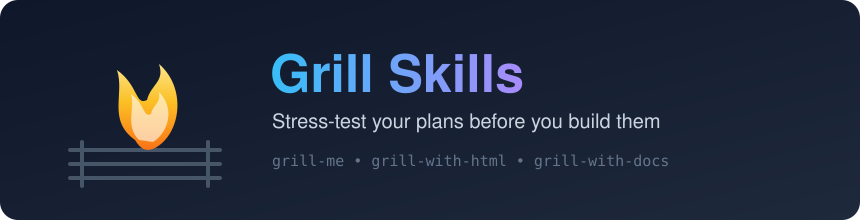

<p align="center">
  
</p>

# Grill Skills

A small collection of portable **agent skills** that interview you relentlessly about a plan or design — walking down each branch of the decision tree until you reach a shared, well-understood solution. Built to run across both Claude Code and Codex.

The idea: before you start building, get *grilled*. The skill plays a tough interviewer, surfacing assumptions, sharpening terminology, and resolving dependencies between decisions one question at a time.

## Skills

| Skill | Where | What it does |
|-------|-------|--------------|
| **grill-me** | `skills/productivity/grill-me` | The core interview. Asks questions one at a time in chat, recommending an answer for each. |
| **grill-with-html** | `skills/productivity/grill-with-html` | Runs the interview through a local HTML page so you can type, paste/drag images, and drop files into context. |
| **grill-with-docs** | `skills/engineering/grill-with-docs` | Challenges your plan against the existing domain model and updates documentation (`CONTEXT.md`, ADRs) inline as decisions crystallise. |
| **shadcn-dashboard** | `skills/engineering/shadcn-dashboard` | Scaffolds a full shadcn/ui dashboard in a Next.js project — sidebar, KPI cards, charts, data table — then starts the dev server. |

## Usage

Each skill lives in its own folder with a `SKILL.md`. Point your agent at the skill, or invoke it by name:

- "grill me on this plan"
- "grill me with html"
- "stress-test this design against our docs"

The agent will start asking pointed questions, offering its recommended answer for each, and only moving on once the current decision is settled.

## Repository layout

```
skills/
  productivity/
    grill-me/           # core chat interview
    grill-with-html/    # visual interview via local HTML form
  engineering/
    grill-with-docs/    # interview + inline documentation updates
    shadcn-dashboard/   # scaffold shadcn/ui dashboard + dev server
docs/                   # Claude & Codex reference notes
AGENTS.md               # shared documentation links for agents
```

## License

[MIT](LICENSE)
